## Hi👋, I'm Rafael Bernal
**🇧🇷 Brazil**
**💻 Systems Analysis and Development Student - SENACSP**

- 🐍Currently studying Python 
- 🚀 Seeking to grow through practical projects
- 📫Contact me via email at rafaelbernal873@gmail.com.
 

 

  
 
 
 

 
 
  
  
  
  
  

 

 
## 📊 GitHub Stats

